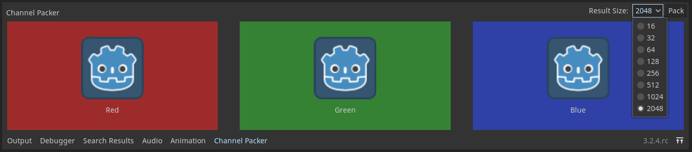

# Channel Packer Addon

Editor plugin that adds a bottom panel to pack multiple textures into one.

## Usage

After enabling the plugin, select the "Channel Packer" bottom panel and drag-and-drop the textures onto the channel slots. Then select the result size, and click "Pack" and choose where to put the generated texture.
